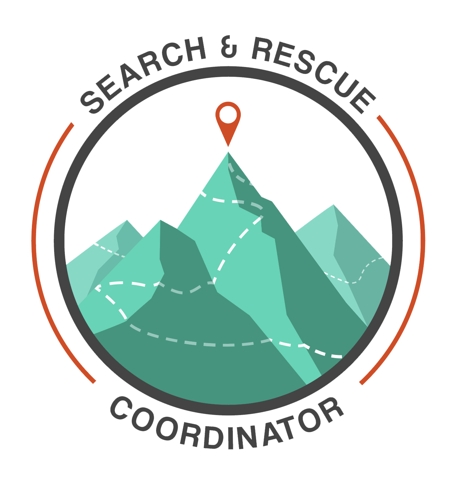
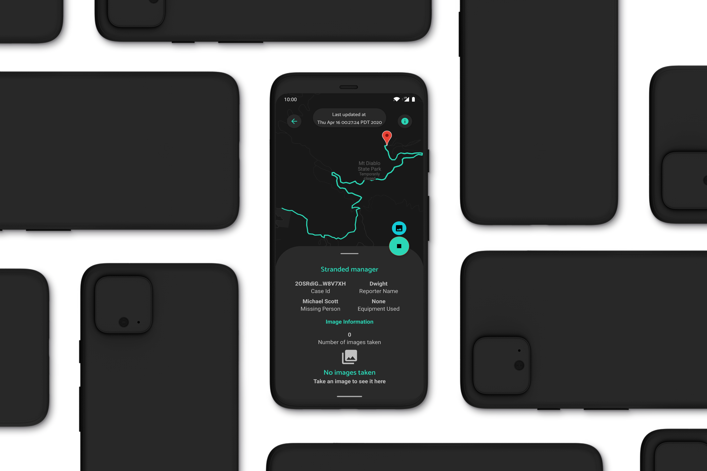

  

	

# SAR Coordinator
The SAR Coordinator Application aids volunteers in search and rescue operations by leveraging the phone's GPS to track volunteer location, and enabling volunteers to send shift reports to the county admins.

Built by SAR Solutions

		

## Build Instructions
- Open project in [Android Studio](https://developer.android.com/studio/index.html)
  - Android Studio version needs to be greater than or equal to 4.0
- Create a new project on [Firebase](https://firebase.google.com/)
  - Go to 'Project settings' in the firebase project and under 'Your apps' click on the Android Icon
  - Enter `com.sarsolutions.sarcoordinator` in the 'Android package name' field
  - Continue through the process by following instructions
    - Make sure to download the config file when prompted
  - Place `google-services.json` (the downloaded config file) in the `app` directory
- Create a new project on [Google Cloud](https://cloud.google.com/)
	-  Enable the `Maps SDK for Android` under 'APIs & Services'
	- Create an API key by clicking on 'Create  Credentials' > API key on the 'APIs & Services' page
	- Follow the steps to create the API key
- Open the build environment's `gradle.properties` file
	- On Windows: `C:\Users\<you>\.gradle\gradle.properties`
  - On Mac/Linux: `/Users/<you>/.gradle/gradle.properties`
	- Enter the Google maps API key from the previous step in the following format
		- `GOOGLE_MAPS_API_KEY="<YOUR_API_KEY_HERE>"`
			- Replace everything inbetween the brackets (including them) with your API key
- In Android Studio, go to `Build > Rebuild Project`
	- If any errors occur, go to `File > Invalidate Caches / Restart > Invalidate and Restart` and try again

## Design Iterations
This section shows the UI design changes and reasons behind them.All of the changes aren't shown, only the major ones. All of the iterations include a dark mode as well but only the light mode is documentated unless there are major differences between the two.

### HackTheU
The first functional componenet of the app was the tracking feature which was made for HackTheU where my team won first place.

	
	

Not a lot to see here design-wise as most of the work happened in the backend.

### Mockup
These are the mockups that were made after the hackathon and before any progress was made.

	
	
	

	

A lot of the componenets aren't following material guidelines, the cases list isn't user friendly, the buttons are placed poorly, the navbar has no depth and there isn't a lot of depth in the UI overall (except for the cards, which are ready for take off).

With my limited knowledge about design and user interaction at the time, these were nothing more than glorified wireframes.

### Alpha (12:23:19)
The inital iteration of the app and the first realiztion of the mockups with a few design improvements. There were quit a few additions comapred to the mockups as I hadn't gone over the minute details while designing the mockups.

#### Login

	

I reduced the icon size, changed the text boxes to be outlined and rounded the "Sign In" button in order to better follow material guidelines. I also added a "forgot password" button which had been overlooked when making the mockups. 

#### Reset Password

	

This is more or less the same as the login screen.

#### Cases List

	

The toolbar is the same color as the theme surface and elevated in order to be less distracting, and the list items are cards in order to make them easier to navigate and read. However, the cards themselves are displeasing to look at, specially with the contrast between them and the text on them.

#### Tracking

	
	

The tracking screen is the same as from the hackathon version except for the addition of the toolbar, new material button style and button colors to better indicate the status of the shift.

#### Settings

	

Another screen that had been overlooked in the mockups was the settings screen. The settings screen only had the options to select the theme and enable/disable testing mode. The settings screen could be accessed from the droop down menu along with the signout button.

### Beta (1:31:20)
Since the alpha, the beta included a lot of backend changes and improvements along with existing UI cleanup for the mobile app. While the cases list screen didn't change much, the shift reports functionality was added.

#### Login

	

Other than new logo, the other big change is the color which much less saturated.

#### Settings

	

The "General" settings card was modernized by getting rid of the orange tint and the "About" section card was added.

#### Tracking

	

The "Case Information" card from the mockups was added with a redesign to better go with the rest of the UI. The card also included the case id and a seperate card to see live shift information. Additionally, the case name was displayed in the nav bar.

#### Shift Report

	

Shift reports where one of the highly sought out features by the Wasatch county. Compared with the mockup, again, there was a major redesign to better accompany the rest of the UI. A input text field was added for the number of hours on search as well as dynamic vehicle cards. In the mockup there were just checkboxes for the activtiy which was a step down from what the county wanted and therefore vehicle cards were added. The fab on the bottom inserts a new vehicle card horizontally, in the "Vehicle section", from where vehicle's information can be filled out. Additionally, the vehicle cards can be swiped up to delete them from the shift report.

### Beta (2:29:20)
This iteration included the prcoess of changing UI elements to uniformly match throughout the app as well as an entire navigation redesign with the addtion of a bottom navigation bar.

#### Login

	

The colors in the app were intended to go with the old logo. With the new logo, I changed the UI colors to better match it.
Additionally, the input text fields were changed so that they were only colored when focued to signify better focus.

#### Cases List

	

With the addition of the bottom nav bar, the drop down menu from the toolbar was removed. The material cards were removed in favor of list items with just two text views indicating the case name and the date of creation for the case. The cards were occupying too much unnecessary space and the contrast between the card surface and the two text views made it tough to read the missing person's name.

#### Failed Shifts

	

This newly added screen looked the same as the Cases List screen, however it functioned differently. Clicking on a case on the Cases List screen would open up the Tracking screen, however, clicking on a case on the Failed Shifts screen would just show a progess bar on top to indicate that the device is attempting to sync the shift with the server.

#### Settings

	

As the drop down menu was removed, the settings page was moved to be accessible via the bottom navigation bar and the "Sign Out" button was moved to the settings page. 
A text view indicating the app version in the "About" section was added along with changing the "View Licenses" button style to make it more obvious that it was clickable.

#### Tracking

	

The tracking screen had a minor tweak where the "Start" button was removed and a floating action button was added to take over it's function. With this change, the Tracking page worked much better with the Shift Report screen.

### Beta (4:01:20)
The base fragments layout had a major redesign with the addition of a custom floating tool bar using a custom motionlayout.

#### Cases List

	

The default toolbar was pointless as it served no purpose other than to show the screen title and look unpleasant. It was replaced with a custom styled toolbar which showed the title in the center in a custom font and could be extended to support a search feature in the future.

The cases list items were redsigned as well to show the name of the missing person as well because the case name would not always be helpful. In addition, an avatar with the missing person's initials was added as well to make it easier to navigate to a specific case.

#### Tracking

	

Another big feature added in this iteration was the ability for volunteers to take images. The "Images Information" card would be displayed once the shift starts and the user can take an image using the "Take Image" button. The images taken would appear under "Images Taken" and can be scrolled horizontally to view additional images. Clicking on an image would take the user to the Image Details screen.

### Image Details

	

The image is displayed on the entire screen and can be panned and zoomed in as well. The image detail card can be dragged up to vew additonal details about the image, enter additional information about the image, upload the image and delete it.

### Shift Report

	

If the images aren't dealt with (uploaded or deleted) while the shift is active, the volunteer can defer the task till after the shift and continue in the shift report screen. Clicking on the image on this screen, works the same way and takes the user to the Image Details screen.

### Release Candidate (4:08:20)
This iteration is the one that is shown in the production video and it includes an addition of a map from the previous iteration.

### Login

	

Small addition of the privacy policy disclosure on the login screen. The "Forgot Password" button was shifted up as well in order to almost group it with the "Sign In" button but not entirely in order to avoid acidental clicks.

### Tracking

	
	

A map was added to the tracking screen to show the user their current location and it was added to the Failed Shifts report screen as well to show the path of the shift.

The case information is shown in a card which can be swiped from the bottom as well as swiped down to dismiss completely. To bring it back up, after its dissmisal, the circular "Info" circular button on the top right of the screen can be clicked. The starting marker shows the starting point of the shift and once the shift stops, a red marker will be shown to indicate the ending position as well. 

The current shift information is shown on the top alongside the back and "Info" circular buttons.
When shift tracking is active, a smaller FAB is shown on top of the primary FAB which enables the user to take an image.

## External Links
- [Play Store Link](https://play.google.com/store/apps/details?id=com.sarcoordinator.sarsolutions)
- [Landing Page](https://sarcoordinator.com/)
- [Admin Page](https://sarcoordinator.com/login)
- [Privacy Policy](https://sar-coordinator.flycricket.io/privacy.html)
